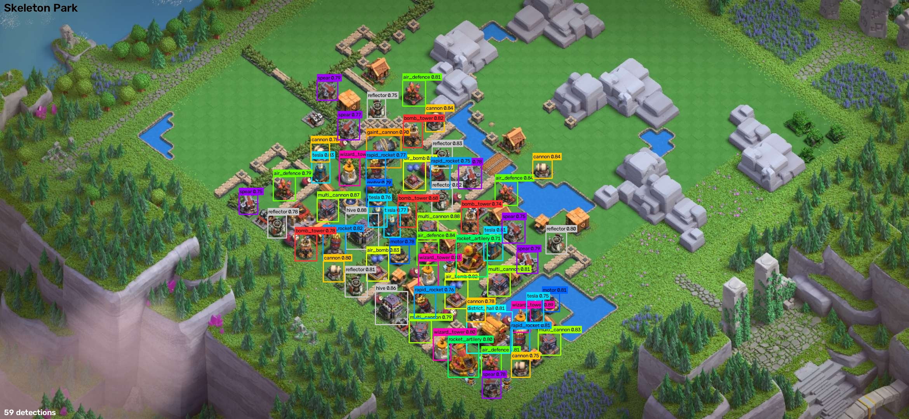
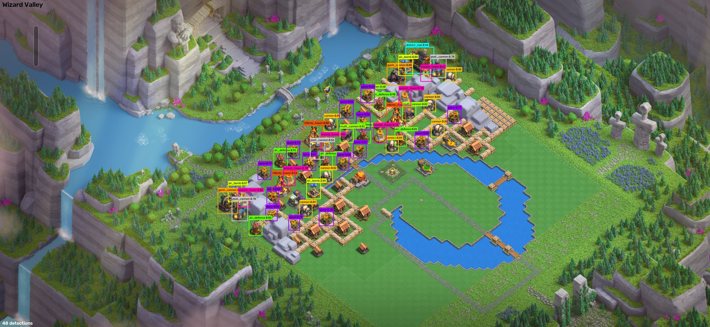
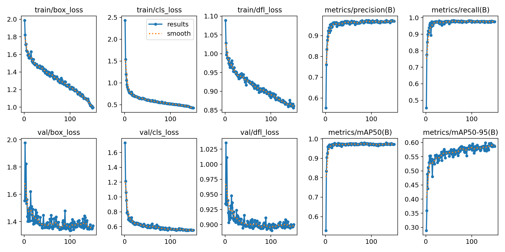

# CoC Clan Capital — Base Matcher

An end-to-end object detection and base-matching pipeline for **Clash of Clans Clan Capital**.

Give it a screenshot of any Clan Capital district, and it detects every defence using a custom-trained YOLO model, converts the layout to normalized JSON coordinates, then runs the **Hungarian algorithm** against a database of 750 bases to find the closest matches by building placement.

---

## Detections




## Training Curves



---

## What it does

1. **Detects** all defence buildings in a screenshot using YOLO11m (23 classes)
2. **Normalizes** positions relative to the District Hall anchor so layouts are scale and position invariant
3. **Auto-calibrates** confidence per district — reruns inference up to 3× until the expected building count is matched exactly
4. **Matches** layouts using the Hungarian algorithm (optimal 1-to-1 assignment by Euclidean distance)
5. **Finds** the top N most similar bases from a database of 750 extracted layouts
6. **Visualizes** differences between two bases — matched buildings gray out, unmatched ones get highlighted with a red dot and label

---

## Final Model

| Property | Value |
|---|---|
| Architecture | YOLO11m |
| Classes | 23 defence types |
| Training images | 468 (156 source × 3 augmentations) |
| Epochs | 150 |
| GPU | NVIDIA RTX 4060 Laptop (~3GB VRAM) |
| Test mAP50 | **0.936** |
| Precision | 0.918 |
| Recall | 0.968 |

### Per-class test results

| Class | mAP50 |
|---|---|
| inferno_tower | 0.995 |
| motor | 0.995 |
| post_cannon | 0.995 |
| post_dragon | 0.995 |
| post_gaint | 0.995 |
| tesla | 0.995 |
| multi_cannon | 0.981 |
| air_defence | 0.981 |
| spear | 0.976 |
| district_hall | 0.972 |
| cannon | 0.970 |
| wizard_tower | 0.966 |
| air_bomb | 0.919 |
| rocket_artilery | 0.927 |
| gaint_cannon | 0.905 |
| bomb_tower | 0.900 |
| rapid_rocket | 0.851 |
| blast_bow | 0.817 |
| crusher | 0.645 |

---

## Training Journey

The model went through 9 rounds of training. Here's the progression:

### Round 1 — v12 (mAP50: 0.269)
Started with just 41 images covering 3 districts (capital_peak, barbarian_camp, wizard_valley).
Most classes had zero detections. crusher, post_dragon, and wizard_tower were completely missed.
Only capital_peak (0.995) had reliable detection due to its unique shape.

### Round 2 — v2 (mAP50: 0.507)
Added balloon_lagoon, grew to 80 images. Most common buildings snapped into shape —
cannon (0.938), blast_bow (0.995), inferno_tower (0.926). Still struggling with crusher (0.032) and motor (0.029).

### Rounds 3–6 — Scaling up data and model size
- Expanded labeling across all 9 districts
- Switched from **YOLOv8n → YOLOv8s → YOLOv8m** chasing accuracy
- Dataset grew from 80 → 120 → 468 images (with Roboflow augmentation: flip, rotation, brightness, blur, noise)

### The model size decision

At ~120 images covering all districts, benchmarked all model sizes:

| Model | Test mAP50 | Precision | Recall | VRAM |
|---|---|---|---|---|
| YOLOv8n | 0.424 | 0.437 | 0.370 | ~3GB |
| YOLOv8s | 0.902 | 0.866 | 0.930 | ~6GB |
| YOLOv8m | 0.928 | 0.867 | 0.949 | ~5GB |
| **YOLO11m** | **0.936** | **0.918** | **0.968** | **~3GB** |

YOLO11m (Ultralytics' newer architecture) beat every other model on accuracy while using the *least* VRAM. Switched permanently.

### Round 9 — v9_final ⭐
Final run with the full dataset (all 9 districts, 468 images, 150 epochs, YOLO11m).
Ran all 150 epochs without hitting the patience cutoff, which meant it kept improving throughout.

---

## Districts

| # | District |
|---|---|
| 0 | Capital Peak |
| 1 | Barbarian Camp |
| 2 | Wizard Valley |
| 3 | Balloon Lagoon |
| 4 | Builder's Workshop |
| 5 | Dragon Cliffs |
| 6 | Golem Quarry |
| 7 | Skeleton Park |
| 8 | Goblin Mines |

---

## Setup

```bash
pip install ultralytics scipy numpy supabase opencv-python python-dotenv
```

Requires PyTorch with CUDA. Install with:
```powershell
pip install torch torchvision torchaudio --index-url https://download.pytorch.org/whl/cu121
```

Weights are included at:
```
runs/train/coc_capital_v9_final/weights/best.pt
```
This path is the default — no config needed. To use a different weights file, set `WEIGHTS` in your `.env`.

---

## Usage

### Find similar bases

```bash
python scripts/find_matches.py --image path/to/screenshot.jpg --district 3
```

```
--district   0-8 (required)
--top        number of results to return (default: 5)
--threshold  minimum match % (default: 80)
--fuzzy      treat cannon and spear as the same type
```

Example output:
```
District:  balloon_lagoon (3)
Mode:      strict
Threshold: 80.0%

==================================================
Top 3 matches ≥ 80.0%:
==================================================
  #1  base_id:    469  |   94.6%  |  51/54 buildings matched
  #2  base_id:    312  |   88.9%  |  48/54 buildings matched
  #3  base_id:    107  |   83.3%  |  45/54 buildings matched
==================================================
```

### Compare two bases side by side

```bash
python scripts/compare_two.py --image1 base_a.jpg --image2 base_b.jpg --district 3
```

Outputs two annotated images to `runs/compare/` — matched buildings are grayed out, unmatched ones are highlighted with a red dot and type label.

---

## Matching

**Strict mode** — buildings must be the exact same type to match.

**Fuzzy mode** — cannon and spear are grouped together (useful when the model occasionally confuses the two similar-looking towers).

The matcher excludes `district_hall` and `capital_peak` from alignment and scoring.
It fits translation and positive x/y scale from same-type building pairs, then uses
Hungarian assignment within each type to find one-to-one correspondences. Separate
x/y scales account for coordinates normalized by image width and height. Each scale
is limited to 0.5–2; rotations, reflections and shear are not fitted.

Distances are measured relative to typical nearest-building spacing, with a matching
tolerance of 0.35 of that spacing. A supported alignment needs at least 20 defenses
across four types, spread over both dimensions. Ambiguous or insufficient arrangements
return zero matches. Proposal generation is bounded to eight class pairs and 32 edges
per pair, with 32 candidate alignments verified and up to two refinements each.

Existing `{type, x, y, conf}` layouts remain usable, including hall-relative coordinates
and layouts extracted without a detected hall. Matching returns the original building
records so Compare can highlight differences at their original pixel positions.

```
match % = matched defenses / max(defenses in A, defenses in B) × 100
```

Minimum match threshold to surface a result: **80%**

---

## Confidence Calibration

Each district has a known exact defence count (e.g. Balloon Lagoon is always 54 or 56). The extractor auto-adjusts:

```
Run 1: conf = 0.25
  too few  → lower conf by 0.05 → Run 2
  too many → raise conf by 0.05 → Run 2
  exact    → done

Run 2 → same logic → Run 3
Run 3 → keep closest result regardless
```

Two valid counts exist per district because some buildings can be hidden underground — all hidden gives the lower count, all visible gives the higher. Partial is never valid.
